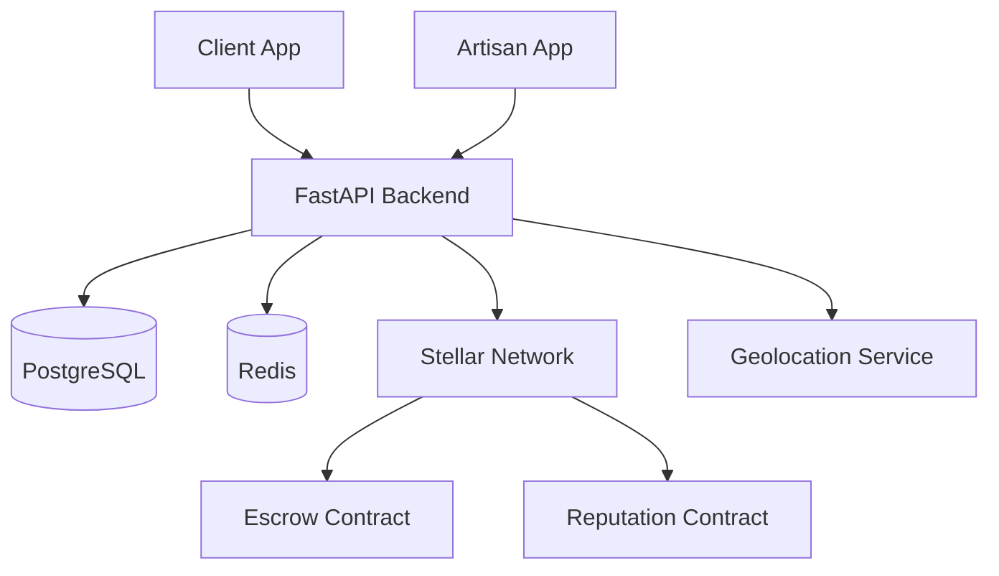

# StellArts 🌟


> **Uber for Artisans — Built on Stellar**

StellArts is a decentralized, location-based marketplace that connects skilled artisans with nearby clients, enabling **fast discovery**, **trusted engagement**, and **secure payments** powered by the **Stellar blockchain**.

[](https://opensource.org/licenses/MIT)
[](https://stellar.org/soroban)
[](https://fastapi.tiangolo.com/)
[](https://nextjs.org/)

---

## 📑 Table of Contents

- [Overview](#-overview)
- [Vision](#-vision)
- [Core Features](#️-core-features)
- [Tech Stack](#-tech-stack)
- [Project Structure](#-project-structure)
- [Getting Started](#-getting-started)
- [Development](#-development)
- [Smart Contracts](#-smart-contracts)
- [Use Cases](#-use-cases)
- [Why Stellar?](#-why-stellar)
- [Architecture](#-architecture)
- [Roadmap](#-roadmap)
- [Contributing](#-contributing)
- [License](#-license)

---

## 🚀 Overview

In many regions—especially emerging markets—finding reliable artisans such as plumbers, electricians, carpenters, mechanics, or tailors still relies heavily on word of mouth. This leads to:

- 🔍 Difficulty discovering trusted service providers  
- 💼 Limited visibility and income opportunities for artisans  
- 💰 Payment disputes and lack of accountability  

**StellArts solves this problem** by combining geolocation, reputation, and Stellar-based escrow payments into a single transparent platform.

---

## 🎯 Vision

To become the **go-to decentralized infrastructure** for local service discovery and payments—starting with artisans and expanding to other skill-based services—while promoting **financial inclusion**, **trust**, and **fair compensation**.

---

## 🛠️ Core Features

### 🔎 Artisan Discovery
- Search artisans by **location**, **skill**, **rating**, and **availability**
- Profile pages with verified skills and work history
- Real-time availability status

### 📍 Location-Based Matching
- Uber-like proximity matching between clients and artisans
- Reduces response time and improves service efficiency
- Optimized geolocation algorithms

### 💳 Secure Payments (Stellar-Powered)
- Clients lock payments in **escrow smart contracts**
- Funds are released only after job completion confirmation
- Eliminates payment disputes and fraud
- Support for multiple payment currencies

### ⭐ Reputation & Reviews
- Transparent rating and review system
- Reputation data designed to be **tamper-resistant**
- On-chain reputation tracking (coming soon)
- Encourages quality service and accountability

### 🌐 Multi-Currency Support
- Pay using stablecoins (USDC) or supported local assets
- Powered by Stellar's native multi-asset and DEX capabilities
- Cross-border payment support

### ⚡ Fast & Low-Cost Transactions
- Near-instant settlement (3-5 seconds)
- Extremely low transaction fees (< $0.01)
- Suitable for micro-payments

---

## 📦 Tech Stack

### Frontend
- **Framework**: Next.js 13.5.1
- **Language**: TypeScript
- **Styling**: Tailwind CSS
- **UI Components**: Radix UI
- **State Management**: React Hooks

### Backend
- **Framework**: FastAPI 0.104.1
- **Language**: Python 3.11+
- **ORM**: SQLAlchemy 2.0
- **Database**: PostgreSQL 15
- **Cache**: Redis
- **Authentication**: JWT (python-jose)
- **API Docs**: OpenAPI/Swagger

### Blockchain
- **Network**: Stellar
- **Smart Contracts**: Soroban (Rust)
- **SDK**: Stellar SDK 13.1.0
- **Features**: Escrow, Payments, Reputation

### DevOps
- **Containerization**: Docker & Docker Compose
- **CI/CD**: GitHub Actions
- **Testing**: Pytest, Jest
- **Code Quality**: Ruff, Black, ESLint

---

## 📁 Project Structure

```
StellArts/
├── frontend/              # Next.js web application
│   ├── app/              # Next.js 13 app directory
│   ├── components/       # React components
│   ├── lib/              # Utility functions
│   └── package.json
├── backend/              # FastAPI backend
│   ├── app/
│   │   ├── api/         # API routes
│   │   ├── core/        # Core configuration
│   │   ├── db/          # Database setup
│   │   ├── models/      # SQLAlchemy models
│   │   ├── schemas/     # Pydantic schemas
│   │   ├── services/    # Business logic
│   │   └── tests/       # Test files
│   ├── alembic/         # Database migrations
│   ├── docker-compose.yml
│   └── requirements.txt
├── contracts/            # Stellar Soroban smart contracts
│   ├── escrow/          # Escrow contract
│   ├── reputation/      # Reputation contract
│   └── Cargo.toml
└── README.md
```

---

## 🚀 Getting Started

### Prerequisites

- **Node.js**: v18+ (for frontend)
- **Python**: 3.11+ (for backend)
- **Rust**: 1.75+ (for smart contracts)
- **Docker**: Latest version (recommended)
- **Stellar CLI**: For contract deployment

### Quick Start with Docker

1. **Clone the repository**
   ```bash
   git clone https://github.com/yourusername/StellArts.git
   cd StellArts
   ```

2. **Start Backend Services**
   ```bash
   cd backend
   cp env.example .env
   docker-compose up -d
   ```
   - API: http://localhost:8000
   - API Docs: http://localhost:8000/docs

3. **Start Frontend**
   ```bash
   cd frontend
   npm install
   npm run dev
   ```
   - Web App: http://localhost:3000

4. **Build Smart Contracts**
   ```bash
   cd contracts
   cargo build --release --target wasm32-unknown-unknown
   ```

### Manual Setup

For detailed setup instructions, see:
- [Backend Setup Guide](./backend/SETUP.md)
- [Frontend Setup Guide](./frontend/README.md)
- [Smart Contracts Guide](./contracts/README.md)

---

## 💻 Development

### Backend Development

```bash
cd backend

# Run tests
make test

# Run with coverage
make test-cov

# Code formatting
make format

# Linting
make lint

# Database migrations
make migration m="description"
make migrate
```

### Frontend Development

```bash
cd frontend

# Development server
npm run dev

# Build for production
npm run build

# Type checking
npm run typecheck

# Linting
npm run lint
```

### Smart Contract Development

```bash
cd contracts

# Build contracts
cargo build --release --target wasm32-unknown-unknown

# Run tests
cargo test

# Deploy to testnet
stellar contract deploy --wasm target/wasm32-unknown-unknown/release/escrow.wasm --network testnet
```

---

## 🔐 Smart Contracts

StellArts utilizes Stellar's Soroban smart contracts for trustless operations:

### Escrow Contract
- Locks funds until job completion
- Multi-signature release mechanism
- Dispute resolution support
- Automatic refunds on cancellation

### Reputation Contract
- On-chain reputation scores
- Immutable review history
- Weighted rating calculations
- Sybil attack resistance

For more details, see [contracts/README.md](./contracts/README.md)

---

## 🌍 Use Cases

- **🏙️ Urban Areas**: Emergency plumbing, electrical repairs, home services  
- **🏘️ Semi-Urban & Rural Communities**: Visibility for skilled artisans beyond word-of-mouth  
- **🌏 Cross-Border Artisans**: Migrant workers receive secure payments without traditional banking barriers  
- **🏢 Small Businesses**: On-demand skilled labor for projects
- **🏠 Homeowners**: Reliable service providers for maintenance and repairs

---

## 🔗 Why Stellar?

Stellar is an ideal foundation for StellArts because it offers:

- **💰 Low Fees**: Affordable transactions (< $0.01) for everyday users  
- **⚡ Fast Settlement**: 3-5 seconds, not minutes or hours  
- **🌐 Multi-Asset Support**: Stablecoins and local currencies  
- **🔒 Escrow Logic**: Trust-minimized payments without intermediaries  
- **📱 Financial Inclusion**: Accessible through mobile-friendly wallets  
- **🚀 Soroban Smart Contracts**: Advanced programmable logic
- **🌍 Global Reach**: Connect artisans and clients worldwide

---

## 🏗️ Architecture



### System Components

1. **Client & Artisan Apps (Mobile/Web)**  
   - Browse artisans, book services, confirm completion
   - Real-time notifications and messaging

2. **Backend API Layer**  
   - RESTful API with FastAPI
   - Matching engine and booking system
   - Rating and review management
   - User authentication and authorization

3. **Database Layer**  
   - PostgreSQL for persistent data
   - Redis for caching and sessions

4. **Stellar Integration**  
   - Payment processing and escrow
   - Smart contract interactions
   - On-chain reputation tracking

5. **External Services**  
   - Geolocation API for proximity matching
   - Notification service (email/SMS)
   - File storage for profile images

---

## 💡 Roadmap

### Phase 1: MVP (Current) ✅
- [x] User authentication and authorization
- [x] Artisan profile management
- [x] Location-based search
- [x] Basic booking system
- [x] Stellar payment integration
- [x] Review and rating system

### Phase 2: Smart Contracts 🚧
- [ ] Escrow smart contract deployment
- [ ] Automated payment release
- [ ] Dispute resolution mechanism
- [ ] Multi-signature support

### Phase 3: Enhanced Features 🔜
- [ ] On-chain reputation system
- [ ] Advanced booking and scheduling
- [ ] In-app messaging
- [ ] Push notifications
- [ ] Multi-language support

### Phase 4: Scale & Optimize 🔮
- [ ] AI-based skill verification
- [ ] Intelligent job matching
- [ ] Mobile apps (iOS/Android)
- [ ] Performance optimization
- [ ] Advanced analytics dashboard

### Phase 5: Ecosystem Growth 🌱
- [ ] Partner integrations
- [ ] Loyalty rewards program
- [ ] Insurance options
- [ ] Training and certification platform

---

## 🤝 Contributing

We welcome contributions from developers, designers, and blockchain enthusiasts!

### How to Contribute

1. **Fork the repository**
2. **Create a feature branch**  
   ```bash
   git checkout -b feature/amazing-feature
   ```
3. **Make your changes**
4. **Run tests**
   ```bash
   # Backend
   cd backend && make test
   
   # Frontend
   cd frontend && npm test
   
   # Contracts
   cd contracts && cargo test
   ```
5. **Commit your changes**
   ```bash
   git commit -m 'Add amazing feature'
   ```
6. **Push to the branch**
   ```bash
   git push origin feature/amazing-feature
   ```
7. **Open a Pull Request**

### Development Guidelines

- Follow the existing code style and conventions
- Write tests for new features
- Update documentation as needed
- Ensure all CI checks pass
- Keep commits atomic and well-described

### Code of Conduct

Please read our [Code of Conduct](CODE_OF_CONDUCT.md) before contributing.

---

## 👥 Target Audience

- **Clients**: Anyone in need of skilled, trusted artisans quickly
- **Artisans**: Skilled workers seeking visibility, fair pay, and verified reputation
- **Developers**: Contributors interested in blockchain and decentralized applications
- **Investors**: Supporting financial inclusion and gig economy innovation

---

## 📄 License

This project is licensed under the MIT License - see the [LICENSE](LICENSE) file for details.

---

## 📞 Contact & Support

- **Website**: [stellarts.io](https://stellarts.io)
- **Email**: support@stellarts.io
- **Twitter**: [@StellArts](https://twitter.com/stellarts)
- **Discord**: [Join our community](https://discord.gg/stellarts)
- **GitHub Issues**: [Report bugs or request features](https://github.com/yourusername/StellArts/issues)

---

## 🙏 Acknowledgments

- [Stellar Development Foundation](https://stellar.org) for the blockchain infrastructure
- [FastAPI](https://fastapi.tiangolo.com/) for the amazing backend framework
- [Next.js](https://nextjs.org/) for the powerful React framework
- All our contributors and supporters

---

<p align="center">Made with ❤️ by the StellArts Team</p>
<p align="center">Empowering artisans through blockchain technology</p>
